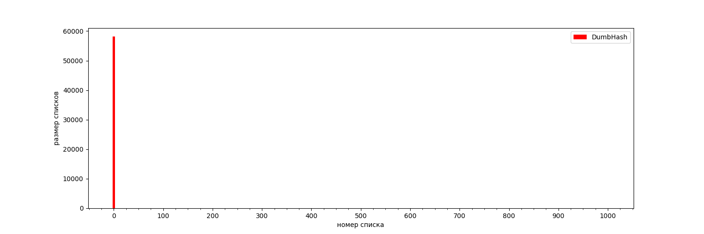
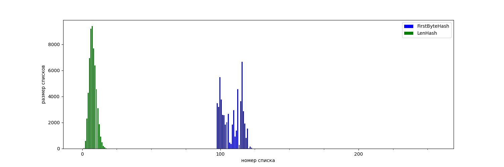
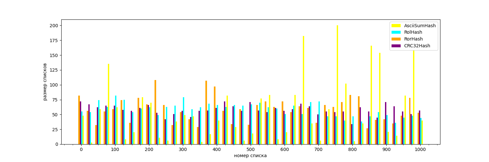

# Хеш-таблица


## Описание
Учебная задача курса Дединского Ильи Рудольфовича.
В работу входит написание хеш-таблицы. Хеш-таблица реализуется через метод цепочек. Для её работы используется структура данных [список](https://github.com/DenzeL2004/list). В случае предельного размера хеш-таблицы структура не перестраивается.


В данной работе хеш-таблица содержит пару, в которой хранится указатель на слово и его длина.


Работа поделена на две части:


1. Сравнение работы хеш-функций.
2. Использование различные виды оптимизаций для ускорение работы хеш-таблицы.


# Часть I
В этой части работы нужно было сравнить распределение элементов по хеш-таблице с различными хеш-функциями.


Для тестирования всех функция был взят один и тот же файл [words.txt](resource/words.txt) c 58110 уникальными английскими словами. Также размер хеш-таблицы не изменялся и был равен 1001.


Список хеш-функций:
1. Хеш-функция, возвращающая всегда ноль.
2. Хеш-функция, возвращающая первый символ в строке (в случае пустой строки - ноль).
3. Хеш-функция, возвращающая длину строки.
4. Хеш-функция, возвращающая сумму ascii-символов строки.
5. Хеш-функция циклического сдвига влево (код представлен ниже).
6. Хеш-функция циклического сдвига вправо.
7. CRC32 хеш-функция.


Реализация хеш-функций, основанных на циклических сдвигах.


```C
uint32_t RolHash(const char *data, const size_t size)
{


   const uint32_t Shift = sizeof(uint32_t) * 8 - 1;


   uint32_t hash = 0u;


   for (size_t it = 0; it < size; it++)
   {
       hash = ((hash << 1) | (hash >> Shift));
       hash ^= data[it];


   }


   return hash;
}
```


Реализация на ассемблере с флагом компиляции -O3.


```C
       test    rsi, rsi
       je      .L4
       add     rsi, rdi
       xor     eax, eax
.L3:
       movsx   edx, BYTE PTR [rdi]
       rol     eax
       add     rdi, 1
       xor     eax, edx
       cmp     rdi, rsi
       jne     .L3
       ret
.L4:
       xor     eax, eax
       ret
```


Из данного фрагмента видно, что компилятор оптимизировал алгоритм циклического сдвига, основанный на битовых операциях, до одной ассемблерной команды rol.


### Анализ


В таблице ниже представлены минимальный и максимальный размер списков при заполнение хеш-таблицы.


| Хеш-функция   | Максимальный размер | Минимальный размер |
|:-------------:|:-------------------:|:------------------:|
| DumbHash      |       58110         |         0          |
| FirstByteHash |       6670          |         0          |
| LenHash       |       9396          |         0          |
| AsciiSumHash  |       234           |         0          |
| RolHash       |       97            |         27         |
| RorHash       |       138           |         20         |
| CRC32Hash     |       79            |         30         |


Ниже представлены графики размеров списков при заполнения хеш-таблицы.







Последний график отражает размеры не всех списков, а лишь тех, чей порядковый номер кратен 25. Это было сделано для большей наглядности.


С полными результатами распределений по каждой хеш-функции можно ознакомится с файлом [result](temp/result_distribution.csv).


### Вывод


Из представленных данных можем заключить, что DumbHash ни в коем случае не рекомендуется для использования в хеш-таблицы количество. По итогу мы получаем массив, который к тому же будет работать медленнее, чем классическая структура данных, так как будет тратится системное время на вызов функции.


FirstByteHash и LenHash работают гораздо лучше, чем DumbHash. Однако количество коллизий остается достаточно большим. Это связано с тем, что берутся английские слова.


Следующие четыре хеш-функции(AsciiSumHash, RolHash, RorHash, CRC32Hash) показали себя гораздо лучше. Несмотря на это, AsciiSumHash выдает заметное число коллизий. Это следует из приведенных графиков, а также из данных таблицы(есть списки, чьи размеры остаются равными нулю).


Несмотря на то, что идея RolHash и RorHash остается одной и той же, на данных тестах RolHash показал себя гораздо лучше.


CRC32Hash показал себя лучше всего, на нем оказалось наименьшее число коллизий, однако стоить отметить, что в данной версии использовалась реализация с дополнительной памятью.

