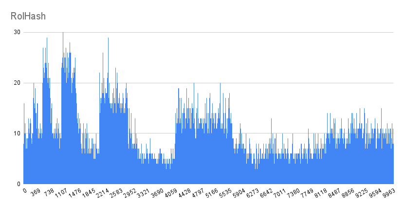

# Хеш-таблица


## Цель работы
Изучить возможности оптимизации хеш-таблицы с целью повышения её производительности.


## Теоретическая справка


Хеш-таблица — это структура данных, которая по ключу сопоставляет индекс массива.


За вычисление индекса массива отвечает **хеш-функция** - функция, осуществляющая преобразование ключа в число (хеш).


При работе с хеш-функциями могут возникать **коллизии** - совпадение значения хеша при различных значениях ключа.
При хорошем выборе хеш-функции шанс возникновения коллизий минимален.


Существуют два основных варианта хеш-таблиц: с открытой адресацией и списками. В данной работе представлена реализация второго варианта с фиксированным размером таблицы (при добавление или удаления элемента размер хеш-таблицы не изменяется).


Главное свойство хеш-таблицы - это короткое время доступа к элементам. Чтобы этого достичь, распределение элементов по спискам должно быть равномерным.


В данной работе в таблице будут храниться строчные английские слова, длина которых не превосходит 32-ух символов. Ключ и значение совпадают.


# Часть I. Сравнение хеш-функций.


В этой части работы было произведено сравнение распределения значений различных хеш-функций.


Для тестирования всех функция был взят один и тот же файл [words.txt](resource/words.txt) с 58108 уникальными словами. Размер хеш-таблицы не изменялся и был равен 10007.


Cреднее распределение при исходных входных данных - 5,8.


Список хеш-функций:
1. **DumbHash** - возвращает всегда ноль.
2. **FirstByteHash** - возвращает байт код первой буквы ключа.
3. **LenHash** - возвращает длину ключа.
4. **AsciiSumHash** - возвращает сумму ascii-символов ключа.
5. **RolHash** - циклический сдвиг хеша влево и xor со значением элемента ключа.
6. **RorHash** - циклический сдвиг хеша вправо и xor со значением элемента ключа.
7. **CRC32Hash** - алгоритм нахождения *контрольной суммы*.


## Анализ


Ниже представлены рисунки графиков размеров списков после заполнения хеш-таблицы.


---


<h4> 1. DumbHash </h4>


Результат этой хеш-функции неудивителен. При таком распределение значений среднее время поиска элемента в таблице будет занимать O(n).


- Максимальный размер списка: 58108
- Минимальный размер списка: 0
- Среднеквадратичное размеров списков: 580.8


---


<h4> 2. FirstByteHash </h4>


Отмасштабированное представление:


Эта хеш-функция показала себя уже лучше, чем предыдущая, однако количество коллизий остается велико.
Это связано с тем, что в качестве ключей брались только английские прописные слова, следовательно в качестве результата функции могло быть всего 26 уникальных значений.


- Максимальный размер списка: 6670      
- Минимальный размер списка: 0
- Среднеквадратичное размеров списков: 142.5


---


<h4> 3. LenHash </h4>


Отмасштабированное представление:


По результатам распределения значений видим, что данная функций крайне плоха в качестве хеш-функции. Причина схожа с FirstByteHash. В связи с тем, что в качестве ключей берутся существующие английские слова, то их длина (в редких исключениях) не будет превосходит 32 символов.


- Максимальный размер списка: 9395 
- Минимальный размер списка: 0
- Среднеквадратичное размеров списков: 194.7


---


<h4> 4. AsciiSumHash </h4>


Результаты этой хеш-функции чуть лучше, чем результаты трех предыдущих функций. Однако данное распределение остается ограниченным, в то время как, мы хотели более равномерное распределение.


- Максимальный размер списка:  230
- Минимальный размер списка: 0
- Среднеквадратичное размеров списков: 23.9


---


<h4> 5. RolHash </h4>





Данная хеш-функция показывает себя гораздо лучше чем все предыдущие. Распределение по спискам не является ограниченным.


- Максимальный размер списка:  30
- Минимальный размер списка: 0
- Среднеквадратичное размеров списков: 4.3


---


<h4> 6. RorHash </h4>


Распределение RorHash также не является ограниченным, однако наблюдаем резкие скачки роста длины списка.


- Максимальный размер списка:  62
- Минимальный размер списка: 0
- Среднеквадратичное размеров списков: 7.9


---


<h4> 7. CRC32Hash </h4>


CRC32Hash хеш-функция показала себя гораздо лучше. Во-первых, график ее распределяется неограниченным. Во-вторых, длины списков почти что совпадают.


- Максимальный размер списка:  17
- Минимальный размер списка: 0
- Среднеквадратичное размеров списков: 2.4


---


## Вывод


Из собранных данных можем сказать, что лучше всего себя показала хеш-функция CRC32Hash. Ее квадратичное отклонение наименьшее среди всех представленных функций. Это говорит о том, что распределение значений по хеш-таблице почти равномерно.


---


# Часть II. Оптимизация хеш-таблицы.


Цель данного раздела - уменьшит время работы программы.


Для выявления *"узких мест"* хеш-таблицы была запущен 20 000 000 раз функция **HashTableFind** - функция поиска элемента в хеш таблице.


В качестве профайлера использовался [callgrind](https://valgrind.org/docs/manual/cl-manual.html). Основным критерием при выборе функции для оптимизации был параметр self - время процесса, потраченное на свое выполнение.


#### Условия тестирования


1. Программа тестировалась на ноутбуке с процессором Intel(R) Core(TM) i5-10300H CPU @ 2.50GHz.
2. Все измерения производились с опцией -O1 компилятора gcc.
3. Все тесты проводились с одним и тем же наборам данных: [words.txt](resource/words.txt), состоящий из 58108 уникальных слов.
4. При тестирование программа запускалась без сторонних приложений (IDE, веб-брузер).
5. При замере времени программы проверки на валидность списка были отключены, с целью измерить непосредственное время, затрачиваемое хеш-таблицами.


В дальнейшем каждая оптимизация будет тестироваться 20 раз после чего в результат будет идти среднее время. Сравнение времени работы будут производиться, как относительно исходной версии без оптимизации (абсолютное), так и относительно предыдущей версии (относительное).


Абсолютный процент ускорения рассчитывается по формуле: $(1 - \frac{CurTime}{BasePointerTime}) \cdot 100\%$.

Относительный процент ускорения рассчитывается по формуле: $(1 - \frac{CurTime}{LastTime}) \cdot 100\%$.


Проведем измерения неоптимизированной версии.


Среднее время работы: $1885 \pm 2$ мс.


Запустим **callgrind** для профилирования программы.


---


<h5> 1. Ускорение хеш-функции </h5>


По результатам анализа работы профайлера ([профилирование 1.1](resource/img/BaseProfiler.png)) было выявлено, что более весомый вклад в замедление производительности программы вносит хеш-функция - **CRC32Hash**.


||
|:--------------------------------------------------------|
|Профилирование 1.1|


Можем заметить, что благодаря строгим требованиям к входным данным, а именно файл состоит из английских слов, длина которых не превышает 32 символов, воспользуемся SIMD инструкцией **_mm_crc32_u32**. Чтобы получить максимальную выгоду от использования инструкций выровняем адреса слов к кратным 32.


<h5> Реализация </h5>


||
|:--------------------------------------------------------|
|Профилирование 1.2|


Из данных профидирования файла мы видем, что общей процент времени, затрачиваемый на функцию поиска хеша строки, стал занимать меньше двух процентов. Рассмотрим как изменилось относительное время.


||Среднее время работы, мс|Процент ускорения|
|:---------------|:------------------:|:---------------:|
|Относительное время работы|$89.01 \pm 2.61$   |    $ 14.3 $      |


---


<h4> 2. Сравнения строк </h4>


По результатам анализа работы профайлера ([профилирование 1.1](resource/img/simpleVersionProf.png)), заметим, что помимо хеш-функции значимый процент во времени работы хеш-таблицы занимает функция сравнения строк.


---


<h5> 2.1 Оптимизация ассемблерной вставки </h5>


Произведем замену **__strcmp_avx2** на эквивалентную функцию, реализованную через ассемблерную вставку.


<h5> Реализация </h5>


||Среднее время работы, мс|
|:------------|:------------------:|
|Относительное время работы |$108,95 \pm 2,71$ |


Мы видим, что наша оптимизация не ускорила, программу, а даже ее замедлила. Это говорит о том, что исходная версия **__strcmp_avx2** реализована более оптимально, чем наша реализация.


---


<h5> 3.2 Выравнивание буфера. Использование интринсик команд </h5>


Можем заметить, что наш входной файл состоит из английских слов, чьи длины не превышают 32 символов. Тогда вместо стандартной реализации **strcmp** реализуем ее через интринсик команды. Идея оптимизации заключается в том, что вместо одного символа мы будем сравнивать по 32 за раз, пользуясь SIMD командой ```_mm256_cmpeq_epi8```.


Стоит отметить, что для использования выровненных интринсик команд необходимо выровнять адреса слов в памяти к кратным 32.


<h5> Реализация </h5>


||
|:--------------------------------------------------------|
|Профилирование 2.1|


Из данных профидирования файла мы видем, что общей процент времени, затрачиваемый на функцию сравнения строк уменьшился. Рассмотрим как изменилось общее время, затрачивается только на тестирование хеш-таблицы.


||Среднее время работы, мс|Процент ускорения|
|:---------------|:------------------:|:---------------:|
|Относительное время работы|$95.86 \pm 2.34$   |     $8.2$       |


---


<h5> 3.3 Ассемблерная функция. Встраивание сравнения. </h5>


Так как компилятор не смог сделать функцию ```StrcmpIntrinsic``` inline сделаем это вручную, но при этом переписав все на ассемблер.


<h5> Реализация </h5>


|Компилятор с флагом -O1|Ассемблерная функция, написанная вручную|
|:--------------:|:----------:|
|||


Из этого сравнения видим, что компилятору из-за того, что приходится вызывать функцию, необходимо сохранить регистры. Тем самым из-за этого идет постоянное обращение к памяти, что замедляет программу.


||Среднее время работы, мс|Процент ускорения|
|:---|:------------------:|:---------------:|
|Относительное время работы |$89.43 \pm 2.33$ |     $14.4$      |


---


<h4> Итоги </h4>


Воспользуемся всеми, примененными методами оптимизаций.


||Среднее время работы, мс|Процент ускорения|
|:---|:------------------:|:---------------:|
|Относительное время работы |$66.90 \pm 2.28$  |     $33.9$       |


На данном этапе возможности для оптимизации поиска в хеш-таблице исчерпаны. Поэтому принято решение прекратить цикл оптимизаций и подвести итоги.


## Вывод


- Заключаем, что не всегда флагов компилятора достаточно для оптимизации программы.
- Благодаря более строгим требования к входным данным удалось ускорить работу хеш-таблицы.


