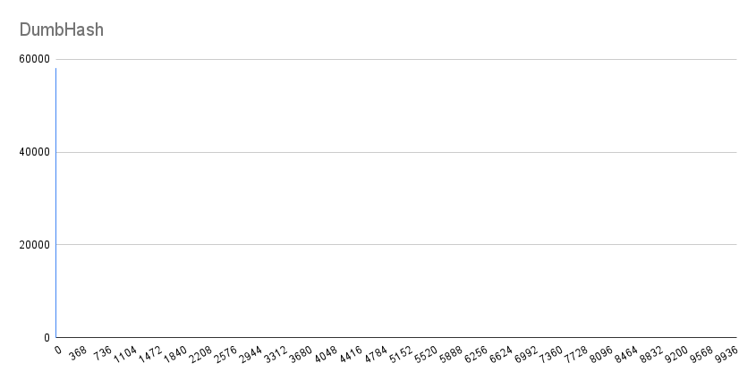
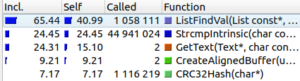
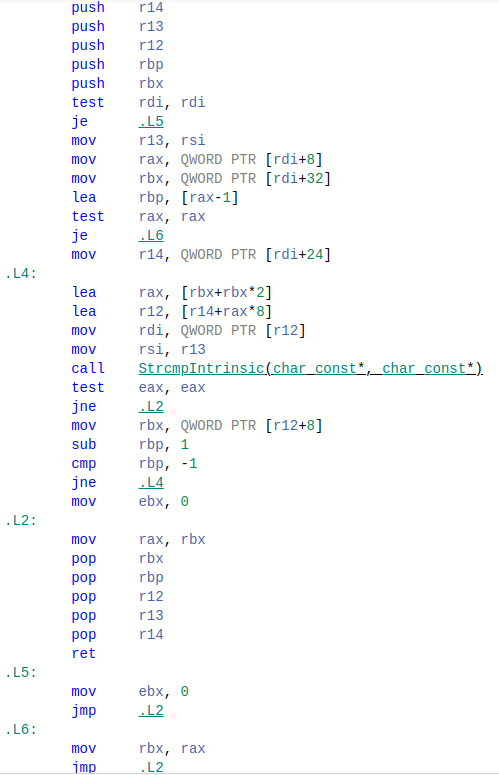

# Хеш-таблица


## Цель работы
Изучить возможности оптимизации хеш-таблицы с целью повышения её производительности.


## Теоретическая справка


Хеш-таблица — это структура данных, реализующая интерфейс ассоциативного массива.
Существуют два основных варианта хеш-таблиц: с открытой адресацией и списками. В данной работе представлена реализация второго варианта с фиксированным размером таблицы (при добавление или удаления элемента размер хеш-таблицы не изменяется).


В данной работе в таблице будут храниться строчные английские слова, длина которых не превосходит 32-ух символов. Ключ и значение совпадают.


Важное свойство хеш-таблиц состоит в том, что, при некоторых разумных допущениях, операции добавление, удаление, поиск элемента в среднем выполняются за время O(1). Чтобы этого достичь, распределение элементов по спискам должно быть равномерным.


За распределение элементов отвечает **хеш-функция** - функция, осуществляющая преобразование клуча произвольной длины в число (хеш).


При работе с хеш-функциями могут возникать **коллизии** - совпадение значения хеша при различных значениях ключа.
При хорошем выборе хеш-функции шанс возникновения коллизий минимален.


# Часть I. Сравнение хеш-функций.


В этой части работы было произведено сравнение распределения значений различных хеш-функций.


Для тестирования всех функция был взят один и тот же файл [words.txt](resource/words.txt). Размер хеш-таблицы не изменялся и был равен 700.


Список хеш-функций:
1. **DumbHash** - возвращает всегда ноль.
2. **FirstByteHash** - возвращает байт код первой буквы в ключа.
3. **LenHash** - возвращает длину ключа.
4. **AsciiSumHash** - возвращает сумму ascii-символов ключа.
5. **RolHash** - циклический сдвиг хеша влево и xor со значением элемента ключа.
6. **RorHash** - циклический сдвиг хеша вправо и xor со значением элемента ключа.
7. **CRC32Hash** - алгоритм нахождения контрольной суммы.


## Анализ


Ниже представлены графики размеров списков после заполнения хеш-таблицы.


---


<h4> 1. DumbHash </h4>





Результат этой хеш-функции неудивителен. При таком распределение значений среднее время поиска элемента в таблице будет занимать O(n).


- Максимальный размер списка: 58108
- Минимальный размер списка: 0
- Среднее квадратичное размеров списков: 2194.7


---


<h4> 2. FirstByteHash </h4>


Эта хеш-функция показала себя уже лучше, чем предыдущая, однако количество коллизий остается велико.
Это связано с тем, что в качестве ключей брались только английские прописные слова, следовательно в качестве результата функции было всего 26 уникальных значений.


- Максимальный размер списка: 6670        
- Минимальный размер списка: 0
- Среднеквадратичное размеров списков: 532.8


---


<h4> 3. LenHash </h4>


По результатам распределения значений видим, что данная функций крайне плоха в качестве хеш-функции. Причина схожа с FirstByteHash. В связи с тем, что в качестве ключей берутся существующие английские слова, то их длина (в редких исключениях) не будет превосходит 32 символов.


- Максимальный размер списка: 9395   
- Минимальный размер списка: 0
- Среднеквадратичное размеров списков: 731.9    


---


<h4> 4. AsciiSumHash </h4>


Результаты этой хеш-функции гораздо лучше, чем результаты трех предыдущих функций. Однако, как мы можем видеть, график распределения значений имеет *"волнообразный"* характер, в то время как нам бы хотелось более равномерное распределение.


- Максимальный размер списка:  234 
- Минимальный размер списка: 0
- Среднеквадратичное размеров списков: 50.6


---


<h4> 5. RolHash </h4>


- Максимальный размер списка:  168 
- Минимальный размер списка: 32
- Среднеквадратичное размеров списков: 28.2


---


<h4> 6. RorHash </h4>


- Максимальный размер списка:  162 
- Минимальный размер списка: 36
- Среднеквадратичное размеров списков: 22.4


---


<h4> 7. CRC32Hash </h4>


- Максимальный размер списка:  114 
- Минимальный размер списка: 57
- Среднеквадратичное размеров списков: 9


---


## Вывод


Из собранных данных можем сказать, что лучше всего себя показала хеш-функция CRC32Hash. Ее квадратичное отклонение наименьшее среди всех представленных функций. Это говорит о том, что распределение значений по хеш таблице почти равномерно.


# Часть II. Оптимизация хеш-таблицы.


Цель данного раздела - уменьшит время работы программы.


Для выявления *"узких мест"* хеш-таблицы была эмулирована ее работа. Для этого функция поиска была запущена 1000000 раз.

В качестве профайлера использовался . Основным критерием при выборе функции для оптимизации был параметр self - время процесса, потраченое на свое выполнение.


#### Условия тестирования


1. Все измерения производились с опцией -O1 компилятора gcc.
2. Размер хеш-таблицы в ходе работы программы не изменялся и был равен 700.
3. Все тесты проводились с одними и теми же наборами данных: [words.txt](resource/words.txt), [test.txt](resource/test.txt)
4. Компьютер был подключен к сети, чтобы система не снимала нагрузку с CPU для экономии заряда.
5. При тестирование программа запускалась без сторонних приложений (IDE, веб-брузер).
6. При замере времени программы проверки на валидность списка были отключены, с целью измерить непосредственное время, затрачиваемое хеш-таблицами.
7. Программа тестировалась на ноутбуке с процессором Intel(R) Core(TM) i5-10300H CPU @ 2.50GHz.


В дальнейшем каждая оптимизация будет тестироваться 20 раз после чего в результат будет идти среднее время. Каждая оптимизация будет сравниваться относительно первоначальной (неоптимизированной) версии. Замеры будут произведены, как и по относительному времени (выполнение только теста), так и по абсолютному времени (выполнение всей программы).


Процент ускорения рассчитывается по формуле $(1 - \frac{OptimizationVersionTime}{SimpleVersionTime}) \cdot 100\%$. 


Проведем измерения неоптимизированной версии.


||Среднее время работы|
|:-------------|:------------------:|
|Относительное время работы|$287,61 \pm 2.65$   |
|Абсолютное время работы|$358,19  \pm 1.87$     |


Запустим **callgrind** для профилирования программы.


---


<h4> 1. Сравнения строк </h4>


По результатам анализа работы профайлера ([профилирование 1.1](resource/img/simpleVersionProf.png)) было выявлено, что более весомый вклад в ухудшение производительности вносит функция сравнения строк - **__strcmp_avx2**.


||
|:--------------------------------------------------------|
|Профилирование 1.1|


<h5> 1.1 Оптимизация ассемблерной вставки </h5>


Произведем замену **__strcmp_avx2** на эквивалентную функцию, реализованную через ассемблерную вставку.


<h5> Реализация </h5>


||Среднее время работы|Процент ускорения|
|:------------|:------------------:|:---------------:|
|Относительное время работы|$221,287 \pm 2,47$  |     23,1%       |
|Абсолютное время работы|$260,22 \pm 2.12$      |     27,3%       |


Как мы можем увидеть ассемблерная вставка уже дала прирост в скорости. Попробуем улучшить этот результат.


---


<h5> 1.2 Выравнивание буфера. Использование интринсик команд </h5>


Можем заметить, что наш входной файл состоит из английских слов, чьи длины не превышают 32 символов. Тогда вместо стандартной реализации **strcmp** реализуем ее через интринсик команды. Идея оптимизации заключается в том, что вместо одного символа мы будем сравнивать по 32 за раз, пользуясь SIMD командой ```_mm256_cmpeq_epi8```.


Стоит отметить, что для использования выровненных интринсик команд необходимо выровнять адреса слов в памяти к кратным 32-ум.


<h5> Реализация </h5>


||
|:--------------------------------------------------------|
|Профилирование 1.2|


Из данных профидирования файла мы видем, что общей процент времени, затрачиваемый на функцию сравнения строк уменьшился почти вдвое. Рассмотрим как изменилось общее время, затрачивается только на тестирование хеш-таблицы.


||Среднее время работы|Процент ускорения|
|:---------------|:------------------:|:---------------:|
|Относительное время работы|$173,517   \pm 2,7$ |     39,7%       |
|Абсолютное время работы |$245,22 \pm 2,47$     |     31,3%       |


---


<h5> 1.3 Ассемблерная функция. Встраивание сравнения. </h5>


Так как компилятор не смог сделать функцию ```StrcmpIntrinsic``` inline сделаем это вручную, но при этом переписав все на ассемблер.


<h5> Реализация </h5>


|Компилятор с флагом -O1|Ассемблерная функция, написанная вручную|
|:--------------:|:----------:|
|||


Из этого сравнения видим, что компилятору из-за того, что приходится вызывать функцию, необходимо сохранить регистры. Тем самым из-за этого идет постоянное обращение к памяти, что замедляет программу.


||Среднее время работы|Процент ускорения|
|:---|:------------------:|:---------------:|
|Относительное время работы|$165,405 \pm 1,343$ |     42,5%       |
|Абсолютное время работы|$232,69 \pm 2,07$      |     35,1%       |


---


<h4> 2. Замена хешь функции </h4>


После профилирования при использовании последней оптимизации имеем ситуацию:


||
|:--------------------------------------------------------|
|Профилирование 2.1|


После применение методов оптимизаций, то, что еще можно было бы ускорить - это функция **CRC32Hash**. 

<h4> Использование интринсик команд </h4>


Стоит отметить, что исходная ```CRC32Hash```, реализованная в данной работе использует дополнительную память. Воспользуемся аппаратными возможностями, применив SIMD инструкции.


На этот раз воспользуемся командой ```_mm_crc32_u32```, предварительно выровняв буффер (как в пункте 1.2).


<h5> Реализация </h5>


||Среднее время работы|Процент ускорения|
|:---|:------------------:|:---------------:|
|Относительное время работы|$228,641 \pm 2,543$ |     20,5%       |
|Абсолютное время работы|$300,01 \pm 1,84$      |     16,2%       |
 

<h4> Итоги </h4>


||Среднее время работы|Процент ускорения|
|:---|:------------------:|:---------------:|
|Относительное время работы|$151,763 \pm 1,98$  |     47,2%       |
|Абсолютное время работы|$221,75 \pm 2.33$      |     38,1%       |


На данном этапе возможности для оптимизации поиска в хеш-таблице исчерпаны. Поэтому принято решение прекратить цикл оптимизаций и подвести итоги.


## Вывод


- Заключаем, что не всегда флагов компилятора достаточно для оптимизации программы.
- Благодаря более строгим требования к входным данным удалось улучшить результат в производительности хеш-таблиц.

